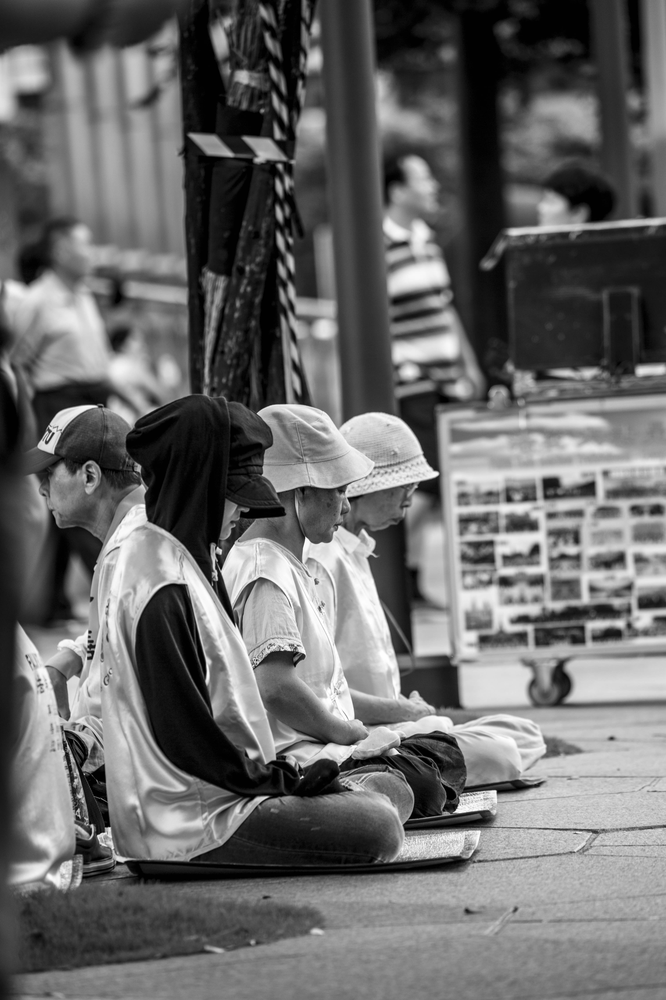

# 人權的意義

「您的餐點烹調時間比較長，要等十分鐘才能上菜，可以嗎？還是您要改點別的？」蒂瑪一邊勾選著飲料，一邊問著。

「沒關係，我可以等。謝謝您。」坐在座位上的是咖啡廳的常客H醫生。這天他帶著兩個朋友來，蒂瑪來點餐前，他跟朋友聊天的話題剛講到一半。

「我覺得前總統保外就醫很莫名其妙，他根本就是在裝病……」蒂瑪離開後，聽到H醫生的朋友M先生說話的聲音。

H醫生一邊聽著朋友說話，沉默了半晌。

「你知道嗎？其實這一切，從現任台北市長之前成立民間醫療小組的時候，法務部就有機會可以處理好的，但是他們沒有。」

「怎麼說？」剛剛嚷嚷著的M先生突然摸不著頭緒的問。

「我先問你，你為什麼覺得前總統在裝病？」

「我覺得民間醫療小組根本是為了要讓前總統出來，才做那樣的醫學報告，說他不能自理生活。」

「所以你質疑的是民間醫療小組的立場，即使裡面的成員都是專業醫師，而且還是由不同科別的專業醫師組成。你還是認為他們的醫療診斷不公正客觀，所以不能作為參考？」

M先生沉默。

「我先假設你是因為這個原因才認為他們不客觀。然後我們來看看法務部這段時間做了什麼？除了不斷說依法辦理，不斷說前總統不符合保外就醫的條件外，什麼也沒做。」

H醫生喝了口茶。

「我問你，如果今天法務部說，好，那我們來把保外就醫制度化，為了讓是否適合出院治療這件事情，得到專業的諮詢，未來保外就醫的評估，我們會成立一個官方的醫療小組，小組成員的評選方式也都詳細條列出來。如果是這樣的一個官方醫療小組評估的結果，你會不會比較願意相信？」

M先生還是沉默的看著H醫生。

「所以為什麼我剛剛會說，這件事情從一開始法務部就有機會處理好，但他們一直都沒有處理。今天是因為涉及到前總統，事情才會鬧得那麼大。但是需要保外就醫的，只有前總統嗎？其他受刑人不會遇到嗎？做得好，這個制度會讓所有的受刑人都能夠受惠，但法務部沒有這樣做。」

H醫生說完，剛剛一直沒講話的P先生開口接著說道：「說真的，我相信法律再怎麼規定，都還是需要有人去負責評估這個人是否需要保外就醫。只要是由人決定的事情，就會有立場，就會有政治。不過我想從另外一個角度來看這件事情。」

「怎麼樣的角度？」H醫生問。

「從人權的角度。我們可以來思考幾個問題，像是前總統為什麼會發病？是因為他在獄中受到不合理的對待導致的嗎？還是單純因為個人健康因素發病？」

P先生停頓了一下，喝了口咖啡。

「不管是哪一個原因，基於人權的理由，都應該要有專業團隊介入評估。在世界人權宣言的第二十五條有提到：『人人有權享受為維持他本人和家屬的健康和福利所需的生活水準。』也就是說即使是罪犯，即使被判刑，他依舊享有維持健康的權利。」

「犯罪的人說什麼人權，嘖。」M先生表情不屑的吐出這句話。

「話這樣說就不太公道了喔。我們來想像一個情境吧，一個強盜犯因為搶劫被判刑，是的，他犯了強盜罪，所以在法律上，他必須付出的代價是有期徒刑，但這難道意味著有一天他在監獄裡中風，也要把他強制關在監獄裡面，不得送醫嗎？」

P先生看著M先生問，沒有給M先生太多的反應時間，P先生又繼續往下說：「他是需要受到懲罰沒有錯，國家給他的懲罰就是坐牢、剝奪他的行動自由。但這不代表國家有權力去剝奪他的醫療權。那些跟他的犯行該有的懲罰無關的權利，像是生命權、受教權、思想自由、宗教自由這些權利，還是必須要被保障。你知道嗎？如果我們覺得一個受刑人不該談人權，不該保有他非關懲罰的權利時，那也意味著國家若侵犯了受刑人的人權，是被人民所默許的。但如果人民默許國家能夠侵犯受刑人的人權，人民又有什麼立場去說這個國家不能侵犯一般人的人權？」

「因為我又沒有犯罪。」M先生小聲嘟囔碎念。

「但國家的力量是很大的。當它開始偷偷摸摸進行權力擴張、侵犯人權的行為，往往就是從這些我們認為不需要保護或堅持的事情開始。你認為你沒有犯罪，所以你的人權應該被保護，那我問你，如果有一天你明明沒有犯罪，卻被國家誣陷你有犯罪的時候，你要用什立場堅持你的人權？在國家面前，一個平民的力量，是很脆弱的。」

M先生沉默。

「有些事情，真的需要去多思考。想想白色恐怖，想想二二八，想想台灣歷史上人民受過的苦難。再回頭來想想，到底有沒有什麼價值是我們應該超越政治立場，共同努力去捍衛的吧。只有當人權的價值能夠不分政治立場被捍衛到底時，這個國家的民主才能說是進了一步。」

-----

一個強盜犯因為搶劫被判刑，是的，他犯了強盜罪，所以在法律上他必須付出的代價是有期徒刑。但這難道意味著有一天他在監獄裡中風，也要把他強制關在監獄裡面，不得送醫嗎？

他是需要受到懲罰沒有錯，國家給他的懲罰就是坐牢、剝奪他的行動自由。但這不代表國家有權力去剝奪他的醫療權。那些跟他的犯行該有的懲罰無關的權利，像是生命權、受教權、思想自由、宗教自由這些權利，還是必須要被保障。你知道嗎？如果我們覺得一個受刑人不該談人權，不該保有他非關懲罰的權利時，那也意味著國家若侵犯了受刑人的人權，是被人民所默許的。但如果人民默許國家能夠侵犯受刑人的人權，人民又有什麼立場去說這個國家不能侵犯一般人的人權？

在國家面前，一個平民的力量，是很脆弱的。
