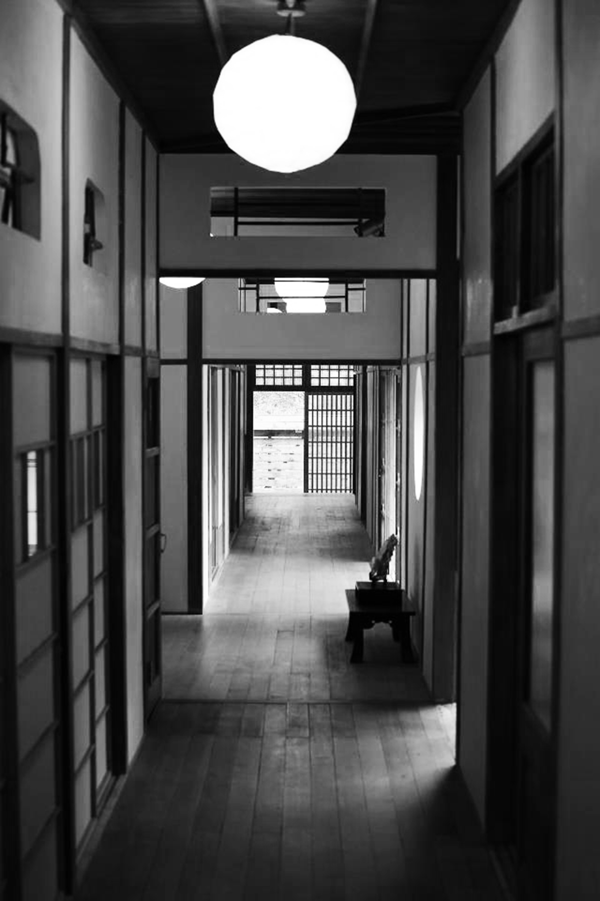

# 我們所以為的「民主」，真的是民主的實際意義嗎？

這天蒂瑪又到了宜蘭拜訪莉格，順便帶了新進貨的花草茶作為伴手禮。天氣冷了，這次兩個人坐在屋內的小茶几聊天。桌上擺著剛泡好的花草茶，以及手工餅乾。

「上次你給我看的那個亞洲民主動態調查結果，我回去仔細看完後，發現大多數人對於民主的認知，就像你說的，跟政治學上對於民主的定義有很大的落差，但是為什麼會這樣？難道在別的國家沒有這樣的狀況嗎？」蒂瑪問道。

「為什麼會這樣呀……這問題有點太大。我們先來看它的調查結果反映出的現象。之後再回頭來談這個問題。」莉格回答。

這時蒂瑪拿著平板電腦，跟莉格一起看著那篇文章內的問卷統計結果。

「這個問卷一共分為三個題組。每個題組都有四個選項，會請做問卷的人以這四個選項去相互比較，選出認為對民主來說最重要的特質，我們暫時先不管問卷分析的結果，而以政治學上民主的定義來看看這份問卷內容。我們先把三個題組總共十二個選項混在一起看。這選項包含了……」

莉格拿出了紙筆，把十二個選項分別寫在紙張上：政府降低貧富差距、人民經由公平自由的選舉選出政府領導人、政府不浪費公帑、人民可自由公開表達政治意見、人民可自由參與抗議、清廉不貪汙、法院確保人民不受政府侵害、政府失業補助、政府確保法律與秩序、媒體可以自由批評政府、政府確保所有人的工作機會、多黨在選舉中公平競爭。

「你覺得這十二項，哪幾項符合政治學上對自由主義民主的定義？」

莉格放下筆，抬頭看著蒂瑪問道。

「我來回想一下啊……整體而言，自由主義民主強調人民可以公平競爭的參與政治，且各種自由權利的保障是自由主義民主的核心主張。以這個標準來看的話，下面這幾項應該是最符合的……」蒂瑪一邊說，一邊拿著筆圈出了幾個項目，包含：人民經由自由公平自由的選舉選出政府領導人、人民可自由公開表達政治意見、人民可自由參與抗議、法院確保人民不受政府侵害、媒體可以自由批評政府、多黨在選舉中公平競爭。

「我圈的這幾個，主要是強調自由的部分。但因為民主也同時強調公平競爭，有幾個可能不能算是民主的核心價值或定義，但對於民主有加分的項目應該是……」蒂瑪換了鉛筆，另外圈出：政府降低貧富差距、政府失業補助、政府確保所有人的工作機會。

「你會發現，如果我們對於民主核心的定義很清楚，這些項目很容易就可以歸納出兩個大類，一類是針對自由，另外一類是針對平等。可是民主也強調法治呀，你為什麼不選擇跟法治有關的項目呢？」莉格對蒂瑪的選擇提出疑問。

蒂瑪歪了歪頭想了一陣後說道：「民主底下的法治，強調的應該是無論人民、政府、還是統治者，都要遵守法律。所以我選了法院確保人民不受政府侵害。但政府確保法律與秩序這一項，有種讓政府可以確保秩序而管束人民的感覺，但這樣的管束只有上對下，它強調的偏重結果，也就是秩序，跟真正的依法而治似乎有點落差，所以我沒有選它。」

「你分析得很清楚，所以上次跟你說的定義顯然你吸收得很完全。」莉格笑了笑。「我們來看實際分組後的分析結果。這幾項是屬於自由主義民主的核心，但問卷結果顯示大部分人認為不屬於民主的重要特徵。」莉格接著在紙上寫出了幾個項目：人民可自由參與抗議、媒體可自由批評政府。

「然後這一項，是不屬於民主重要特徵，而且是連對民主加分都稱不上，但問卷結果顯示大部分人認為屬於民主的重要特徵。」莉格在紙上換了一邊另外列出：政府確保法律與秩序。

「詳細的報告內容你會發現不同年齡層、不同政黨傾向對於民主的認知，歧異是很大的。我這裡只把極端值拿出來，對照台灣現況的氛圍來說說，我們是不是常常聽到有人說『台灣就是太自由了』，所以很多人認為自由參加抗議，跟媒體自由批評政府並不是民主的核心，好像就沒什麼好意外的？」

莉格拿起了一片餅乾吃，一邊喝了口花茶後，繼續說著：「然後大多數人對於法治的觀念，其實還停留在過去政府用法律管束人民、政府本身卻可以置身法律之外的觀念。也因為如此，以至於很多人認為政府確保法律與秩序是理所當然的。但事實上，法治應該是法律凌駕於所有人之上，包含民眾，包含政府，也包含統治者。」

莉格深吸了一口氣。丟出最後的問題：「從這個報告可以看出來的是，台灣民眾對民主的認知與實際民主的核心精神，在哪些認知上是有落差的。如果我們對於民主核心價值有真實透徹的了解，理論上不應該有這樣的狀況。所以反過來說，我們的人民平均而言對於民主的了解是不夠深入的、甚至很多認知是跟民主核心價值相違背的。但是為什麼？」

蒂瑪看著莉格，接二連三的問題讓她有點招架不住。一時之間不知道要說什麼好。莉格看蒂瑪愣住的反應，笑了出來。

「我們下次再來聊聊吧！」莉格說。

-----

整體而言，自由主義民主強調人民可以公平競爭的參與政治，且各種自由權利的保障是自由主義民主的核心主張。

民主底下的法治，強調的應該是無論人民、政府、還是統治者，都要遵守法律。但政府確保法律與秩序這一項，有種讓政府可以確保秩序而管束人民的感覺，但這樣的管束只有上對下，它強調的偏重結果，也就是秩序，跟真正的依法而治似乎有點落差。

台灣民眾對民主的認知與實際民主的核心精神，在很多地方的認知是有落差的。如果我們對於民主核心價值有真實透徹的了解，理論上不應該有這樣的狀況。所以反過來說，我們的人民平均而言對於民主的了解是不夠深入的、甚至很多認知是跟民主核心價值相違背的。但是為什麼？
