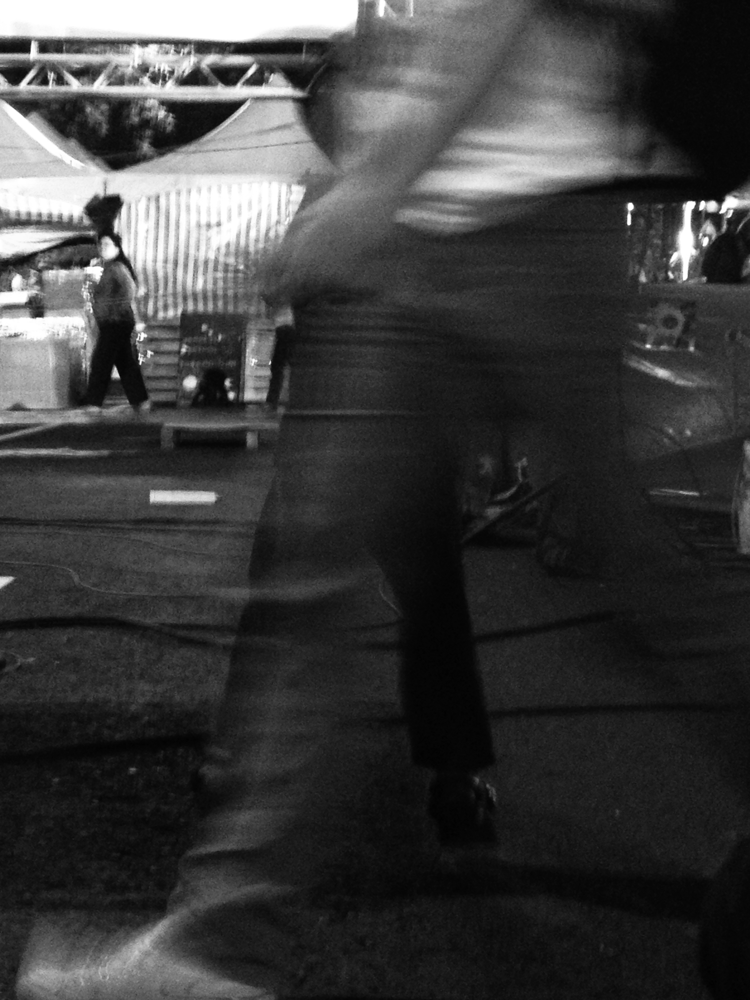

# 自由，是什麼？

這天咖啡廳來了一對母女。女兒大概是國中生。兩杯拿鐵喝了一半，桌上一壺檸檬水還剩三分之二，旁邊擺著書，媽媽似乎是在幫女兒預習功課。

「媽，今天公民老師講了一個有關美國民主的小故事。」女兒說著。

「喔？是什麼樣的小故事？」媽媽問。

「愛迪生曾經發明一個東西，叫做『投票表決器』，他覺得不管是國會也好、州議會也好、市議會也好，投票都是一件很繁瑣的事情，議員必須從自己的位子走到投票處去投票。而有一些議員不只投票，還會對自己為什麼贊成或反對發表演講。這過程實在太耗時，只是一個簡單的投票，有時候卻要好幾天才能投完，所以他發明了這個東西，覺得可以省去大家很多的時間，讓投票變得更有效率。」

女兒一邊說著，一邊在作業簿空白處畫起圖來。

「嗯……乍聽之下好像很有道理。後來呢？」

媽媽看起來好像有話要說，但還是先讓女兒繼續講完。

「他後來發明成功了，就很高興的帶著他的發明到波士頓的市議會，跟那裡的議員展示這個機器。沒想到，每個議員都顯得興趣缺缺。於是他決定到華盛頓找更有影響力的國會議員。經過別人層層引薦，找到了一位叫做懷特的政治家。懷特說：這東西不錯，不過我雖然喜歡這個發明，卻不歡迎它。」女兒模仿著政治家講話的神情。

「愛迪生一定覺得很疑惑吧？」媽媽喝了一口咖啡。

「對呀，愛迪生問懷特為什麼。懷特解釋說：你看起來一點都不懂得政治。你知道議會討論中，有一種戰術叫做『拖延戰術』嗎？對於少數派來說，這是一個很重要的戰術。我舉個例子給你聽，例如國會要通過一個法案，但少數派不想讓它通過。若用了你這個機器，那麼經過簡單的表決，多數派就可以很輕鬆的達到他們的目的。但若沒有這個機器，少數派就可以透過議論、演說來拖延時間，尋求轉機，讓多數派重新思考問題，甚至達成妥協。」

這時候女兒頓了頓，喝了口咖啡，又倒了一杯水。

「那你覺得多數派會喜歡這個機器嗎？」媽媽問著。

「愛迪生也跟懷特問了同樣的問題。懷特說，不會的，因為多數派跟少數派都是一時的，在不同議題上他們隨時都有可能變成少數派，所以不會有多少議員喜歡你這台投票器。」

女兒一邊說，一邊搖搖頭。

「你聽完這個故事有什麼感想呢？」媽媽繼續問。

女兒停頓了一分多鐘，想了想才回答：「我想到常常有人說民主是少數服從多數。但聽完這個故事以後，我總覺得這句話好像哪裡怪怪的。」

媽媽看著女兒微笑，拿起筆，在紙上一邊寫字一邊說：「少數服從多數主要指的是投票多數決的結果，要用什麼樣的方式去決定通不通過。例如要過三分之二才算通過，這屬於條件多數決，而只要有投票的過半數就算通過，這屬於簡單多數決。」

媽媽在紙上畫了條件多數決、簡單多數決的差異，並寫下多數尊重少數、少數服從多數。「但關於民主，還有另外一句話：多數尊重少數。我們在說這兩句話的時候，往往把這句放在後面。其實你看美國民主的經驗。他們是把多數尊重少數，放在少數服從多數之前。」

服務生這時候送上甜點，媽媽跟女兒各吃了幾口後，媽媽繼續說道：「關於民主，美國流傳著一句話：『民主是兩隻狼和一隻羊，投票決定午餐吃什麼，而自由就是一隻武裝的羊反對這次投票』。為什麼在民主國家，很多政策制定需要開公聽會，需要讓雙方互相辯論？原因就在於民主制度的精髓，是透過不斷對話，彼此反覆協商，想辦法找出雙方都能夠接受的共識。」

「要是羊沒有武裝的自由，那就會被狼透過少數服從多數的投票，變成狼的食物吧！」女兒笑著說。

「沒錯。民主的真諦是不管多數或少數，都要能夠敞開心胸表達意見，認真聆聽對方的想法。設法在不同中找出相同，甚至願意各退一步，妥協出一個折衷、損害最小的結果。多數尊重少數、少數服從多數，所指的意思，就是任何的投票都必須要在充分溝通討論、並且雙方都試著去理解對方的前提下去進行。這樣的民主，才不會因為過度延伸少數服從多數，而淪於多數暴力。同樣，這並不是說多數尊重少數，就等於少數人的聲音就可以比較大，民主真正追求的，是不管你是多數或少數，每個人的意見、權利都該是平等的。」

媽媽仔細的回答著。

「媽，這樣聽起來，民主感覺很沒有效率耶。因為即使是不同意見的兩方，他們各自內部也不太可能真的大家意見都完全一致。」女兒若有所思的問著。

「是啊，比起極權國家來說，民主確實是比較沒有效率的制度。這時候要思考的就是：究竟是把所有的權力都集中在少部分權貴手上，而大多數人在爭取權力的自由被限制的比較好呢？還是上位者權力是被大多數人民賦予的，而大多數人保有比較多自由，可為自己爭取權力比較好呢？」媽媽反問。

「嗯…我覺得人民需要保有比較多的自由，因為人民沒有實權，如果連自由都被剝奪，那等於完全沒有反抗的機會。」女兒回答。

「在追求民主的過程，大家都應該要去思考，沒錯，民主不是一個容易達成的制度。其中有很多破壞、混亂，但民主的可貴，在於每個人都能夠擁有一點高貴、一點尊嚴，而不只是集中在某些有權有錢的人身上。若民主追求的終極目標是平等，就必須要在過程中不斷去檢討，我們會不會只強調了少數服從多數，卻忘了多數也要尊重少數，因此壓迫到少數，變相的造成不平等。」媽媽喝了口咖啡，做了結語。

-----

民主是兩隻狼和一隻羊投票決定午餐吃什麼，而自由就是一隻武裝的羊反對這次投票。

民主的真諦是不管多數或少數，都要能夠敞開心胸的表達意見，認真聆聽對方的想法。設法在不同中找出相同，甚至願意各退一步，妥協出一個折衷、損害最小的結果。多數尊重少數、少數服從多數，所指的意思就是任何的投票，都必須要在充分溝通討論、並且雙方都試著去理解對方的前提下去進行。而這樣的民主，才不會因為過度延伸少數服從多數而淪於多數暴力。也並不是說多數尊重少數，就等於少數人的聲音就可以比較大。民主真正追求的，是不管你是多數或少數，每個人的意見、權利都該是平等的。
