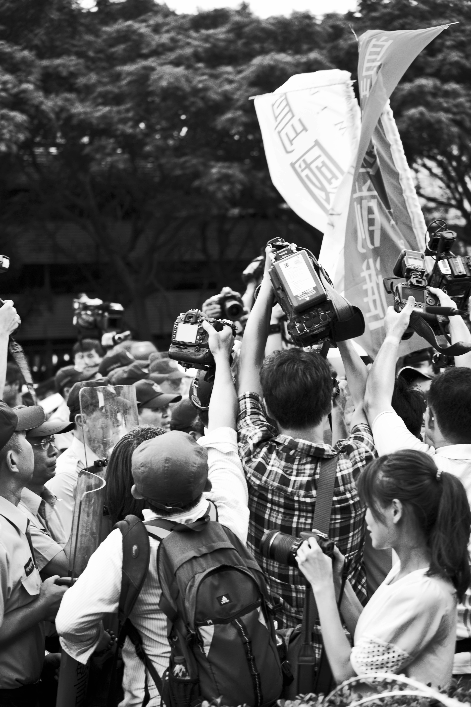

# 台灣，太自由了？

這天，咖啡館來了一家子，訂了六人的位。「您好，我是林先生，有訂位，六個人。」開口的是一位約二十五歲的男子，看起來是這家人的兒子。

「好的，您的位子在這。」服務生帶著六人到已併好桌的位子。在點餐等待的空檔，這家人聊起天來。

「那個市長候選人K一定有貪汙啦。M G 1 4 9就是要翻到底，一定有問題。」開口的人看起來是這家子的父親，年紀大約六十歲左右。

「爸，今天聚餐，大姑姑、大姑丈也有來，可以先不要聊這個話題嗎？」

兒子靜默了一陣後，開口說道。

「為什麼不聊？你們這些年輕人，都只會支持讓台灣社會越來越亂的那些反對黨。」

父親的口氣顯得很不客氣。

「K又不是反對黨的人，他是無黨籍的。」兒子回應。

「都一樣啦，他背後還不是反對黨在支持的，反正他們都只是要來讓台灣亂的。」父親說著。突然間，大家不開口了，默默的吃著剛送來的麵包。原本一個氣氛還算融洽的家族聚會，變得有些尷尬。

「爸，為什麼你會覺得，他們只是要來讓台灣亂的？」兒子開口問著，口氣很平靜。

「他們就是來亂的。」

「為什麼？誰跟你說的？」兒子繼續問。

「電視、報紙都有報啊，名嘴也有說，他們貪汙，慫恿學生上街，亂抗議。」

「所以電視、報紙寫的，都一定是對的？名嘴說的都是正確的？」兒子繼續問。

「那當然，不然報紙幹嘛報。台灣就是太自由了，才會這麼亂。」父親隨後不講話，低著頭喝湯。

一直很冷靜的兒子，講話開始顯得有點激動。「爸，你喜歡看怎樣的報紙，喜歡看什麼新聞，這些，是你的自由。我今天再怎麼不喜歡那些媒體的報導角度，我也無權強迫你不要看那些新聞。為什麼呢？因為在民主社會下，你有選擇的自由。你可以選擇你想看的媒體，選擇全盤相信你看到的資訊。但其實你也可以選擇試著去看其他的媒體跟報紙，差別只在於你願不願意，想不想。」

兒子說完，喝了口水，整理了一下自己的情緒。「很多時候，我們只是不願意去做這件事情而已。因為看別的報紙，會讓你覺得台灣好亂。為什麼那麼多人出來抗議，為什麼大家不安安分分的就好，要這樣出來鬧、出來亂。」

這時候原本在一旁安靜的女兒開口：「你們會懷念過去的安穩，懷念過去戒嚴的時代，因為在那個時代，你看不到混亂。可是你看不到，不是因為沒有，是因為訊息刻意被掩蓋。爸，看不到，不代表沒有。」

父親這時候依舊不說話，只是靜靜的看著女兒。女兒繼續說著：「戒嚴的時候，你們覺得很安定，可是那是用很多人失去的自由換來的。自由是好的，自由可以讓人依照自己的希望去發展。但從不自由到自由，一開始卻會讓人感到是壞的。因為自由意味著秩序不再是用強迫不合理的方式塑造出來。大家都可以說自己想說的，也會因為每個人想的不同而開始爭吵。所以你覺得很亂，而想起以前的舊記憶，覺得那樣不亂是更好的。可是這個社會也正因為變得自由，大家可以說自己想說的，做自己想做的。我們才有可能發展出更多元的觀點、更不同的視野。」

女兒用湯匙攪拌著濃湯，喝了一口。

「我不敢說自由就一定更進步、更好。但更自由的環境，才可能讓這個社會有更平等的機會。爸，你應該還記得，戒嚴末期剛開放人民出國時，都還要用公司考察的名義才能出國，我想姑姑一定也還有印象。以現在的觀點，會覺得一般人出國被限制，是很不可思議的事情。」

兒子這時候開口問道：「爸，你覺得戒嚴那個時代，人民出國被限制，是合理的嗎？」

父親沒有回答。

「自由確實有自由的缺點。它讓原本的秩序沒有了，它逼迫每個人要去思考不自由時不需要思考的事情。像以前歐洲封建時代，屬於底下階層的人，是不用去思考怎麼賺大錢的，因為他們根本沒有可以賺大錢的自由，何必去思考？可是如果不是因為自由，我不會有機會自己選擇要不要去國外念書。在過去，只有有權的人才能夠送小孩出國。沒有權的人，連選擇要出國的自由都沒有。」

兒子輕輕的嘆了口氣。

「爸，我不想跟你爭辯M G 1 4 9帳戶合法不合法，是因為網路上有很多資料了。如果你願意，我可以印給你看，如果你不願意，我也尊重你選擇不想去看這些資料的自由。但是當你說，這個社會會這麼亂，就是因為太自由。我想告訴你，那是因為，自由，本來就會有缺點跟優點，你不能因為只看到缺點，就去否認自由大部分的優點，而這些優點還是你現在一直在享受的。」

父親沉默不語。這時候一直沒說話的姑姑開口了。

「年輕人有年輕人的想法，時代不同了。你即使不認同，也不需要強迫他們接受你的想法。我女兒拿手機給我看孫子的視訊，讓我覺得這個時代真是進步。很多事情都是以前沒辦法想像的。我們年輕的時候，上一輩給的一些限制，也常常讓當時的我們覺得難受。又何苦在我們老的時候，把那些限制也給下一代？該放手的時候，要放手啊！」

-----

但從不自由到自由，一開始會讓人感到是壞的。因為自由相對意味著，秩序不再被強迫用不合理的方式管束。

可是這個社會也正因為變得自由，大家可以說自己想說的，做自己想做的。我們才有可能發展出更多元的觀點。更不同的視野。

自由確實有自由的缺點。它讓原本的秩序沒有了，它逼迫每個人要去思考不自由時不需要思考的事情。

自由，本來就會有缺點跟優點。你不能因為只看到缺點，就去否認自由大部分的優點，而這些優點還是你現在一直在享受的。
