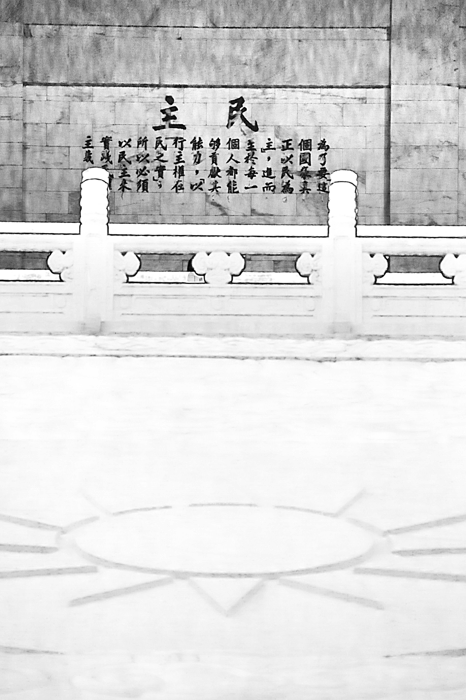

# 民主是什麼？

這天固定會到咖啡廳舉行讀書會的那群人又出現了，裡面的客人多了幾名新成員。服務生們竊竊私語著。

「你看，那個不就是上次那個帥哥？」

「對耶，這樣以後他們固定讀書會，就可以每週看到他嗎？」

有個客人看起來是讀書會的組長，在大家各自分享完這次這章的心得後，開口提問。

「講到民主，在台灣常常聽到一種言論，就是：『在人民的民主素養開化以前，我們真的有資格擁有民主嗎？』大家對這句話的看法是什麼呢？」

紅髮男子這時候開口說話：「在發表看法以前，我希望大家先回想一下托克維爾寫《民主在美國》的用意。我們看一下書的第……七十五頁。」

紅髮男子翻開了書，指著書上的一個段落。

> 托克維爾與朋友的書信中提到：『我希望能夠呈現什麼是真正的民主社會，讓那些狂熱的民主派了解，民主不如他們想像的那麼光輝燦爛，更不是一個容易可以達到的夢想……也要讓那些反對民主，認為民主就是毀壞、混亂、謀殺、貪汙的那些人知道，民主有其高貴之處。只不過民主的高貴，和他們理解的高貴很不一樣。民主的高貴，是讓每一個人身上都有一點高貴、有一點尊嚴，而不是讓及少數的人擁有所有的尊嚴跟高貴……我希望他們了解，不管他們喜不喜歡，這個世界就是會朝越來越平等、越來越民主的方向發展。』

紅髮男子闔上了書，頓了頓。「要理解托克維爾說這段話的意思，勢必要先把這本書都看完，但我先從讀這本書的心得，來回答你問的這個問題。回溯歷史，美國最初能夠產生民主，跟它特定的地理環境以及殖民歷史脈絡，有很大的關係。而民主確實需要有一定形式的政府，跟一定程度的人民習慣，才有可能正常運作。但是，如果我們都同意，這個世界應該朝越來越平等的方向前進，那就必須要了解，只有民主，才能讓社會變得越來越平等。」

紅髮男子的聲音漸漸的高亢起來。

「民主制度是一個以群眾作為基礎的制度。這樣的制度，牽涉到的層面很廣，像是立法、行政、司法，還有權力跟權力之間的制衡關係。這麼多的環節，是沒有辦法只靠理論來設計的，不管多聰明的人，都不可能在一開始就規劃周全。因此只有在現實裡面去實驗，在實驗過程中一點一點地暴露出問題，一點一點地修正改革，才有機會發展出一套實際可以操作、可以運作的民主。

你可以把民主制度，想像成一個擴大版的創業計畫。你在創業的過程中，會不斷的遇到的問題，進而去做自我修正調整，但這些問題幾乎不會是你在開始創業的時候就能先預知到的。而不同的公司會面對的困境也會不同，最後發展也一定會不同。你也可以把民主制度，想像成一個成長中的小孩，小朋友在成長的過程裡面，會因應外在的環境自我調適。而不同家庭出生的小孩，自我調適的結果也會不同，因此每個小孩子的個性、發展也會不同。」

紅髮男子突然停了下來，看看大家。讀書會的其他人這時候都看著男子。一片安靜。男子撥了撥頭髮，又繼續開始說話。

「民主相對於其他的政治制度，就是這樣的一個有自我修復能力以及彈性的制度。也因為這樣，法國後來發展出來的民主制度，在很多操作細節上，就跟美國民主制度不一樣。像法國是雙首長制，而美國是總統制，這跟他們各自的歷史背景有很大的關係。也就是說，民主，不是『一個東西、一個固定的制度』，而是『一個追求平等的過程』。我們必須要在這個過程裡面，同時培養自身的民主素養。當人民的民主素養到達一個程度，才能讓『比較不好的民主』慢慢的變成『比較好的民主』。

只有先理解，民主是一個追求平等的過程，才能夠理解，為什麼我們在追求民主的過程中，會有這麼多不同的聲音。既然追求平等，那麼每個人都會有發聲的自由；為了追求平等，所以我們才必須不斷的辯論、思考、討論，去實驗出讓社會能夠更平等的方法。在辯論的過程中，有發言的自由，就有反駁的自由。」

讀書會的人，有的人繼續看著紅髮男子，有的人低頭寫字，像是在做筆記。男子喝了口水，繼續發表意見。

「很多人會把反駁、說服的過程，誤當成言語暴力。我要提醒的是，所有的批評、反駁，跟發表個人意見的言論自由，是相同的自由互相並存。而這樣的自由，也只有在民主社會內，才有可能充分擁有。如果將說服、反駁、論證的過程當成是一種『暴力』，那針對政治制度的討論，將在沒有言論自由的前提下消失。所謂的民主制度，只是為了達成民主精神，而產生的執行方法。當民主成了上位者對下位者的施捨，而人民認為自己不值得『擁有』的時候，那一定是誤會了民主。民主當初在美國，是由下而上產生的。

所以，『在人民的民主素養開化以前，我們真的有資格擁有民主嗎？』這個問題並不成立，因為民主不是一種擁有，不只是投票，不只是制度，而是一種為了讓大家都變得更平等的實踐。一種『將公共事務視為自己的事』的實踐。該做的，不是去問有沒有資格擁有，而是一邊提昇自己的民主素養，一邊去實踐民主。」

紅髮男子做了結語。

突然之間，沒有人說話，安靜了好一陣子。

「萊伯特，你講的這段話實在很精采。」讀書會組長開口說道。

「真的，我看完這本書，都沒想到那麼多……」坐在組長旁的女子點了點頭附和著。

這時候，在櫃檯的服務生瞎起鬨起來。

「哇，他超強的耶！」

「對啊，剛剛聽到他名字，好像叫萊伯特？」

「你們幾個，趕快去送餐點啦。」蒂瑪忍不住小小的斥責。

「遵命！」服務生們一哄而散。

-----

也就是說，民主，不是『一個東西、一個固定的制度』，而是『一個追求平等的過程』。我們必須要在這個過程裡面，同時培養自身的民主素養。當人民的民主素養到達一個程度，才能讓『比較不好的民主』慢慢的變成『比較好的民主』。

當民主成了上位者對下位者的施捨，而人民認為自己不值得『擁有』的時候，那一定是誤會了民主。

民主不是一種擁有，不只是投票，不只是制度，而是一種為了讓大家都變得更平等的實踐。一種『將公共事務視為自己的事』的實踐。該做的，不是去問有沒有資格擁有，而是一邊提昇自己的民主素養，一邊去實踐民主。
