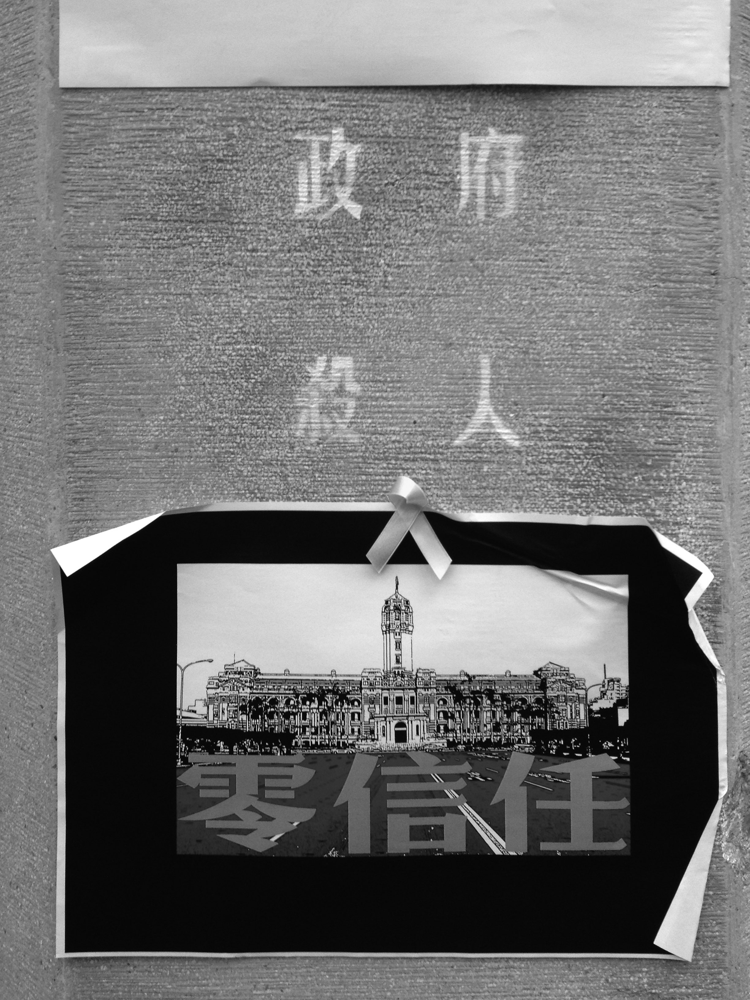

# 什麼是公民？

這天晚上，讀書會的那群人又出現在咖啡廳。

「哇！那個紅髮帥哥又來了耶！」咖啡廳的服務生們起鬨著。

「不知道他們今天讀書會內容會討論什麼呢？」蒂瑪想著。

讀書會成員點完餐後，一開始由被分配到的組員進行簡易的導讀，接著組長清了清喉嚨，開始講話。

「這陣子發生的很多事情，真的都可以跟書裡寫的事情做比照呢。」

「是呀，像是之前三一八學運，還有現在香港正在進行中的雨傘革命。讀完這本書，我才知道原來法國大革命後，他們還花了一百多年，才從紛亂的政局邁向穩定的民主發展。」A女是今天的導讀，接著組長的話說著。

「我最近讀了另外一本書，叫《總統是不可靠的》，這本用書信體描寫美國民主的發展史，也非常精采。看完我才覺得，以前我自己對於民主的了解，實在太薄弱了。」C男搭腔。

「因為看《以平等之名》這本書，我也去找了亞洲其他國家的一些相關資料，就以離我們比較近的國家，像是南韓、還有日本，他們在邁向民主的過程中，也都經歷過很多抗爭。以南韓來說，他們在民主化的過程中，大學生多次站在民主運動的前線，在抗爭最激烈的時期，有的學生甚至不惜犧牲自己的性命，來顯示爭取民主的決心。」D男說完，一邊把他帶來的另外一本書《明治維新》拿給大家傳閱。

「如果不去閱讀這些歷史，我們常常會以為，我們現在有的權利，都是理所當然的。以為只要可以投票了，就算是民主了，以為投票就是民主的同義詞。甚至在台灣的歷史脈絡下，由於台灣從威權轉向民主，整體來說偏向和平轉移，但政府所制定的教育內容，卻沒有灌輸正確的民主意識，以至於很多人誤以為民主是權威者給的禮物、施捨。」組長說完，喝了口水。

這時候服務生送上了冰拿鐵、美式咖啡、冰紅茶，大家紛紛舉手表示飲料是誰的。成員們一邊喝著飲料，一邊繼續討論著。這時候紅髮男子萊柏特開口說話。

「法國大革命後，整個國家陷入很長一段時間的混亂。托克維爾撰寫《民主在美國》，就是處在這樣的一個時代背景，他想透過他看到的美國民主經驗，透過從地理環境、美國人民背景、制度形成的整體分析，去告訴他在法國的同胞，法國大革命之所以會有那麼可怕的動亂，因為那時候的法國沒有真正的公民，而且即使經歷了長久動盪，法國仍沒有真正建立起公民的基礎。法國基層人民的根本心態，還是屬民，而不是公民。」

「這樣說來，應該要來釐清，我們喊得這麼大聲的公民，到底應該是什麼？而屬民又是什麼？」組長提出問題。

「沒錯，所謂的公民，會把公共事務視為自己的事情。但屬民，則會認為公共事務是上面的人的事，是管我的人的事。法國大革命後，法國人一直高喊著公民，然而在這樣滿街都是公民的社會，只有口頭上的公民。大家把口號喊得這麼響亮，但心態上卻還是屬民。」萊柏特答道。喝了口冰拿鐵之後，他看看大家。又繼續接著說：「但是不要誤會，美國公民的基礎，不是建立在什麼抽象的理想上，不是什麼要造福大眾、或是心中先有什麼政治理念想實現。公民參與公共事務的出發點，是為了保護、爭取自我的利益，是以自私為出發點。正是為了避免因為訂定公共事務，而傷害了部分群體成員。為了讓每個成員都有權利表示反對、發出抗議，美國的公共精神，從來就不是基於什麼大愛、什麼理想，而是基於在地的、自利的立場。但也因為如此，保證了美國政治權力一貫由下而上的安排原則。」

之後，讀書會的成員繼續鬧哄哄的討論著各自的心得。蒂瑪心裡想著：「我們很少會去懷疑自己在教育過程中被灌輸的一切。但當台灣的民主走到現在，好像很多事情都卡住的時候，除了積極討論社會議題，是不是也應該要花些心思，去看看別人的民主是怎麼一回事？也許我們一直想不到的答案，在別國的歷史裡面，能夠找到一些線索。」

-----

所謂的公民，會把公共事務視為自己的事情。但屬民，則會認為公共事務是上面的人的事，是管我的人的事。法國大革命後，法國人一直高喊著公民，然而在這樣滿街都是公民的社會，只有口頭上的公民。大家把口號喊得這麼響亮，但心態上卻還是屬民。

美國公民的基礎，不是建立在什麼抽象的理想上，不是什麼要造福大眾、或是心中先有什麼政治理念想實現。公民參與公共事務的出發點，是為了保護、爭取自我的利益，是以自私為出發點。正是為了避免因為訂定公共事務，而傷害了部分群體成員。為了讓每個成員都有權利表示反對、發出抗議，美國的公共精神，從來就不是基於什麼大愛、什麼理想，而是基於在地的、自利的立場。但也因為如此，保證了美國政治權力一貫由下而上的安排原則。
